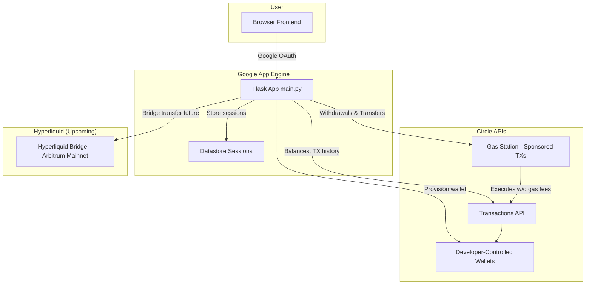

# Revenant

Revenant is an algorithmic trading platform that leverages [Circle’s Developer-Controlled Wallets](https://developers.circle.com/w3s/programmable-wallets) for automated crypto perpetual futures trading through [Hyperliquid](https://app.hyperliquid.xyz/).

------------------------------------------------------------------------

## Features

-   **Google OAuth Login** with database and session persistence in Google Cloud
    Datastore
-   **Circle Wallet Integration** (developer-controlled wallets on
    Arbitrum Sepolia testnet)
-   **Deposits & Withdrawals** in USDC (with QR code support)
-   **Wallet Dashboard** with funding vs. Hyperliquid balance
    breakdown
-   **Strategies Page** with custom trading strategy cards
-   **System Notices & Alerts**

------------------------------------------------------------------------

## Architecture Diagram  

------------------------------------------------------------------------

## Getting Started

You can access Revenant directly via the frontend here: **[https://revenant1.appspot.com](https://revenant1.appspot.com)**  

No local setup is required to start exploring the app. Simply log in with **Google OAuth**, deposit test USDC on **Arbitrum Sepolia**, and interact with your wallet through the browser interface.  

---

### How Revenant Uses Circle Developer Tools  

Revenant integrates **[Circle’s Developer-Controlled Wallets](https://developers.circle.com/w3s/programmable-wallets)** and **[Gas Station](https://developers.circle.com/w3s/gas-station)** feature to provide a fully gas-sponsored experience.  

- **User Wallets**  
  - Each new user automatically gets an **Arbitrum wallet** provisioned via Circle’s API.  
  - Wallets are linked to the user’s Revenant account and securely managed by Circle.  

- **Gas Station (Sponsored Transactions)**  
  - Users **never need ETH for gas**. Circle covers transaction fees behind the scenes.  
  - This means deposits, withdrawals, and transfers are entirely seamless, no more worrying about topping up gas.  

- **Withdrawals**  
  - When you withdraw USDC to an external wallet, the transaction is executed via Circle’s APIs.  
  - Gas fees are automatically sponsored, so you only send USDC, not ETH.  

- **Transfers to Hyperliquid (Upcoming)**  
  - Revenant will enable direct **bridge transfers from Arbitrum → Hyperliquid**.  
  - These too will be gas-sponsored via Circle’s Gas Station, ensuring a **one-click, frictionless UX** for moving capital into trading strategies.  

------------------------------------------------------------------------

## Project Structure

    .
    ├── app.py                  # Flask app routes
    ├── wallet_service.py       # Circle wallet + transaction utilities
    ├── datastore_session.py    # Custom Datastore-backed session manager
    ├── utils.py                # Helpers (QR codes, USD formatting)
    ├── templates/              # Jinja2 HTML templates
    │   ├── base.html
    │   ├── wallet.html
    │   ├── strategies.html
    │   └── account.html
    ├── static/                 # CSS, JS, images
    ├── requirements.txt
    └── README.md

------------------------------------------------------------------------

## Tech Stack

-   **Backend**: Flask (Python)
-   **Auth**: Google OAuth via Authlib
-   **Database**: Google Cloud Datastore
-   **Wallets & Transactions**: Circle Developer-Controlled Wallets API
-   **Frontend**: Jinja2 + TailwindCSS + Lucide icons

------------------------------------------------------------------------

## Roadmap

-   [ ] Fiat offramp integration
-   [ ] Real custom trading strategies
-   [ ] Admin dashboard for system monitoring
-   [ ] Expand to Arbitrum Mainnet and other L2s

------------------------------------------------------------------------

## Tags

`flask` `circle` `blockchain` `web3` `wallet` `trading` `usdc`
`google-cloud-datastore` `oauth`

------------------------------------------------------------------------

## License

MIT License © 2025 Revenant